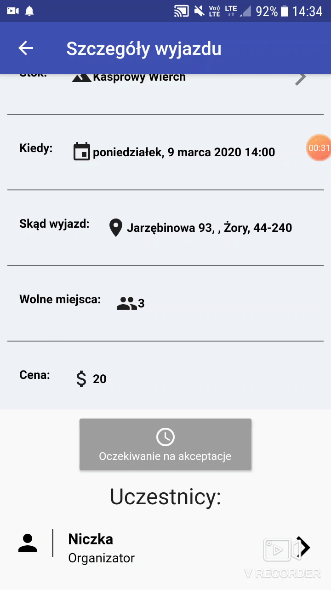
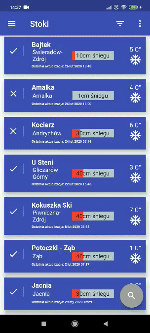
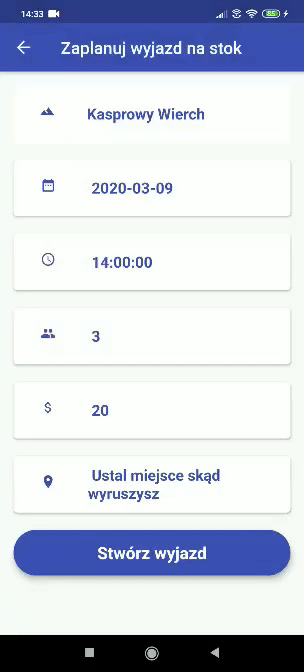
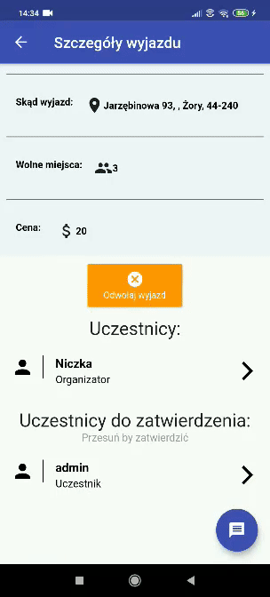

Na Stok App
=====
Na Stok is mobile app, that was created to make it easier to organize trips to the ski slopes in Poland. It allows you to check current ski sklopes condition, plan your own trips, or join trips nearby. To communicate efficiently with your trip companions you can use our dedicated chat.

### Technologies and programming languages, that i used in the project:
+ Python
+ Flask
+ Node.js
+ MongoDB
+ Express
+ Flutter
+ Dart

# Demo









# Getting Started

There are two ways of installing Na Stok app:

### Download .apk

You can download .apk file, that is available in [release v1.0](https://github.com/jmysliv/na-stok-app/releases/tag/v1.0).

### Build from source
Make sure your Flutter environment is setup and you have an Android emulator installed and running. Instead of Android emulator you can use your own mobile with proper setup. If you need some help you can check out Flutter's [documentation](https://flutter.dev/).

Then run the following command in your terminal.
```
$ git clone git@github.com:jmysliv/na-stok-app.git
$ cd na-stok-app/na-stok-flutter/na_stok_flutter/
$ flutter run
```